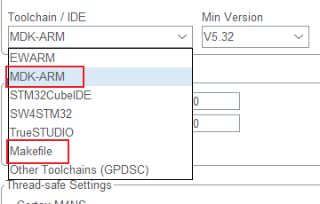
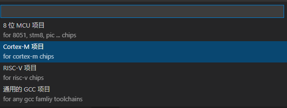
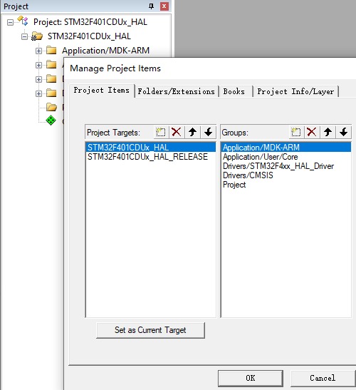
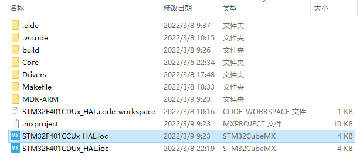
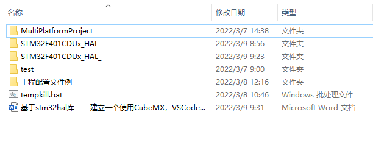
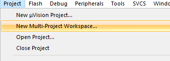
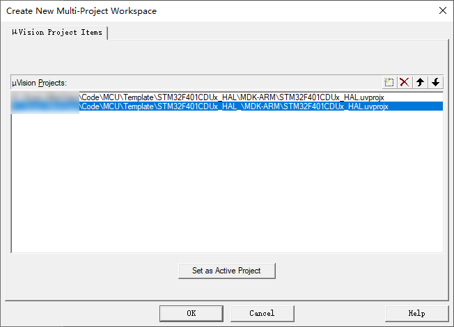
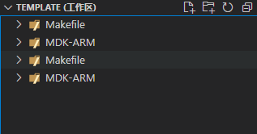
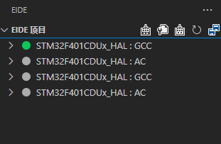

# 基于CubeMX创建快速开发模板

## 写在前面

前面我们介绍了以下几个方法：

1.  *基于ARMCC工具链，配置CubeMX生成MDK工程；*

2.  *由VSCode-EIDE插件（以下简称EIDE）导入MDK工程，并创建EIDE项目，从而替代Keil5MDK
    IDE（以下简称MDK）进行开发的方法；*

3.  *基于GCC工具链，配置CubeMX生成Makefile文件，并创建EIDE项目的方法*

*（这三种方法以下简称方法1,2,3）*

以下，我们围绕前面涉及的一系列工具——一个代码生成器，两种IDE以及对应的两条编译工具链，探讨由这三种方式创建工程的优劣，以期得到一个全面的基于stm32hal库快速开发工程模板。

## 创建模板的流程

试回顾创建一个模板的流程，不论基于stm32标准库还是HAL库，使用MDK还是EIDE，这个流程都是相似的：

1.  *新建一个文件夹作为工程目录/工作区，根据需要修改其名称；*

2.  *将官方提供的库文件、用户文件和CMSIS文件等复制到文件夹内，可以选择复制完整的库相关文件或是仅复制需要的库相关文件；*

3.  *在IDE内新建工程/项目，在工程/项目内配置库相关文件目录和头文件路径；*

4.  *配置其它工程/项目选项，包括芯片型号，输出选项，预置宏定义，编译选项，下载与调试配置等；*

*End. 进行后续用户开发……*

由于在开发的过程中需求是随时变化的，我们倾向于将完整的库相关文件复制到文件夹内，并根据需求在工程/项目内随时对目录增删。这样一来，我们就需要在后续开发中重复上述步骤3。

对于需要灵活使用hal库+ll库，从而一定程度上兼顾快速与性能的开发场景，其库文件数量大，重复步骤3对目录的增删难免繁琐和冗余。特别是就目前而言(2022.3.8)，MDK工程与EIDE项目都不支持在图形界面内对目录批量删除文件。

通过配置CubeMX生成工程，可以在生成代码的同时自动化地对目录增删，从而免于在开发过程中重复上述步骤3，提高开发效率。因此，基于CubeMX创建工程模板，是本文所探讨的快速开发的重点。

*使用CubeMX生成工程还有一个好处——可以选择不为每个文件夹都复制完整的库相关文件，只需确保开发环境中有CubeMX及相应库文件，剩下交给生成器即可——手动创建模板则需要考虑复制完整的库文件以减少工作量。另外，减小文件夹大小对于版本管理和协作开发都更有利。*

## CubeMX生成工程的文件结构

用到的工具链

观察CubeMX生成的MDK工程和Makefile文件，如下

可以看到，MDK工程存放在MDK-ARM文件夹下，包含ARMCC工具链相应的引导文件。而Makefile生成的文件则存放在工程根目录，包含相应引导文件和链接脚本等。

不同工具链生成的库相关文件是相同的，Drivers文件夹存放库文件和CMSIS文件，Core文件夹存放用户文件。

当在CubeMX中选中“复制全部库文件”时，CubeMX会在生成工程时将给定型号的所有库文件和CMSIS文件复制到Drivers文件夹下，大小约为几百M。

而当选中“仅复制必要库文件”时，CubeMX会在生成工程时仅复制需要的库文件和CMSIS文件。*需要注意的是，此时CubeMX会删除多余的库文件，但不会完全删除多余的CMSIS文件，如果使用EIDE建立工程则需要格外留意（详见后文）*。

Drivers文件夹内的库文件和CMSIS文件或被全部复制，或根据需要被复制；Core文件夹内的用户文件则往往是对库文件的调用实例，总是随用户开发而变化。

CubeMX生成的MDK工程也采用与文件结构相近的工程目录：库文件和CMSIS文件被添加在Drivers的子目录下，用户文件和.s引导文件被添加在Application的子目录下。

使用EIDE创建项目并配置项目目录时，可以沿用这样的工程目录。

对于方法2，在从MDK导入工程时能自动配置工程目录；

对于方法3，将Core文件夹和Drivers文件夹添加为EIDE特有的“普通文件夹”，使项目目录与文件结构保持同步，配合CubeMX的“仅复制必要库文件”选项，同样可以略过手动添加文件的步骤。注意若选择过“复制全部库文件”选项，则需要删除多余的CMSIS文件，再切换为“仅复制必要库文件”选项生成代码，否则将因为引入多余的头文件而报错。

## 创建快速开发模板的流程

总结前面几个部分，我们可以得到基于CubeMX创建快速开发模板的流程：

1.  **新建一个文件夹作为工程目录/工作区，根据需要修改其名称；**

2.  **配置CubeMX生成Makefile文件，并创建基于GCC的EIDE项目（方法3）；**

3.  **配置CubeMX生成MDK工程（方法1）；**

4.  **由EIDE导入MDK工程，并创建基于ARMCC的EIDE项目（方法2）；**

5.  **配置各个工程/项目的其它选项；**

**End. 进行后续用户开发……**

## 创建一个快速开发模板

### 新建一个文件夹作为工程目录/工作区

略。

### 配置CubeMX生成Makefile文件

新建一个CubeMX工程，将工具链设置为Makefile，仅复制必要库文件，生成代码。

### 配置CubeMX生成MDK工程

将工具链设置为MDK-ARM，再次生成代码。

### 整理文件夹

生成代码完毕，得到文件夹如下。

将Makefile文件移至文件夹内，与MDK-ARM文件夹相对称。

### 由EIDE导入MDK工程，并创建基于ARMCC的EIDE项目

打开VSCode，转到EIDE界面，导入生成的MDK工程。

在关闭EIDE项目的前提下打开\\MDK-ARM\\eide.json，修改项目名称，目的是使项目名称具对称性，非必须。

### 创建基于GCC的EIDE项目

打开EIDE界面，新建一个Cortex-M项目

添加源文件夹Core和Drivers

由于我们为保持对称性，将Makefile文件移至工程子目录中，此时提示待添加文件夹位于目录上级，不允许添加

直接修改json文件

可以看到文件夹已经添加成功，添加对应GCC工具链的引导文件，链接脚本和预处理器定义

至此，一个包含GCC和ARMCC编译工具链，以CubeMX为核心的快速开发工程模板初步完成。

\*在EIDE从MDK导入工程时，会生成一个.cmsis文件夹，占用工程模板90%以上的空间，笔者尚未确定此文件夹的用途，并且希望能删除此文件夹，请指教。

## 配置各个工程/项目的其它选项

### 修改编译输出目录

修改MDK工程选项，和两个EIDE项目的.eide/eide.json文件，将输出目录设置到上级

得到build文件夹效果如下

### 配置工程\\项目选项

编译规范统一设置为Obalanced/Og，gnu99，C++14；下载工具配置为DAPLink。

### 配置EIDE调试选项

配置EIDE调试文件，位于”\\.vscode\\launch.json”目录下。需要注意的是，ARMCC编译生成的.axf文件不被Cortex-Debug插件支持。当使用EIDE编译时，可在插件设置中勾选”尝试将axf转换为elf文件”选项。

### 在文件夹创建VSCode工作区文件

在模板文件夹创建一个VSCode工作区文件，添加两个子目录。

重新打开文件夹后，可以看到调试界面和EIDE的界面如下

### 至此，工程模板配置完毕！

将模板保存至模板文件夹，开发时直接复制出来即可。

### \*一个有待完善的部分

前面我们提到为保证对称性，修改了EIDE项目的项目名称，这会影响后续开发时，使用方法2由EIDE从MDK导入工程，以更新目录的操作。

目前，我们给出的方法是在导入前，将eide.json文件备份，在导入完毕后，选取json文件的目录更新部分并复制回备份文件，再将备份文件覆盖回去。

这个步骤确实繁琐而有失快速开发的本意，因此你可以选择不修改EIDE工程的命名，这样在导入项目时EIDE将不会覆盖原有的项目选项，而是只更新目录部分。后续笔者考虑了解并使用CubeMX的自定义模板功能，以期在生成代码的同时自动修改eide.json内的文件目录结构。

## 对使用MDK多工程多目标的大型工程与本快速开发模板兼容性探讨

我们知道，MDK有多工程多目标功能，VSCode的工作区也可层层包含，形成层次结构，下面讨论大型工程开发和使用CubeMX快速开发模板开发的兼容性。

### 对多目标工程的探讨

MDK目录包含工程名，目标名，以及共享的文件目录。经过尝试，CubeMX在生成代码的同时，会将工程名和目标名修改为与文件夹相同的特定名称，此名称在CubeMX图形界面中一经指定，不能更改。

这就与我们在大型工程开发时，创建多目标对应不同的编译选项，快速切换开发版本和发行版本的思路相冲突。

可以将其它目标命名为同名带后缀的方式，约定不带后缀的配置为开发版本。

而对于同一款产品有高低配版本，想要将区别放在多目标中的开发场景，本快速开发方法也难以派上用场。

即使将多个CubeMX工程放在同一目录下，它们也只会分别生成单独的MDK工程。

因此，除非型号相近的芯片有时可以通用代码，共用一个工程，否则不建议采用多目标的形式进行快速开发。

对于EIDE而言，项目选项总是保存在项目文件夹的”/.eide/eide.json”中，一个项目对应一处配置。注意到在该选项文件中我们有target一项保留了导入的MDK工程选项，但是不能直接在EIDE项目选项中应用或切换。总的来说，EIDE目前也不支持类似多目标的概念。

### 对多工程工作空间的探讨

我们可以将多个如前文所述而创建的工程模板放在同一目录下，形成多工程的概念。

在MDK中创建一个工作空间，添加工程文件

效果如下，可以在多个工程中将其中一个设置为活动工程。

在VSCode中的添加操作与前面相同

总结

本快速开发模板开发与多目标开发是相冲突的，但是与多工程开发是兼容的。

## 结语

本文围绕CubeMX，探讨了快速开发的方法。后续拟进一步探讨对不同型号stm32创建模板的共同点，在此基础上创建常见型号的stm32快速开发模板，并结合git将模板上传至gitee/github，以减少重复造轮子的工作，真正实现快速开发。

## 参考链接

<https://www.strongerhuang.com/categories/STM32CubeMX系列教程/>

<https://www.strongerhuang.com/categories/Keil系列教程/>

[https://docs.em-ide.com/\#/](https://docs.em-ide.com/#/)
